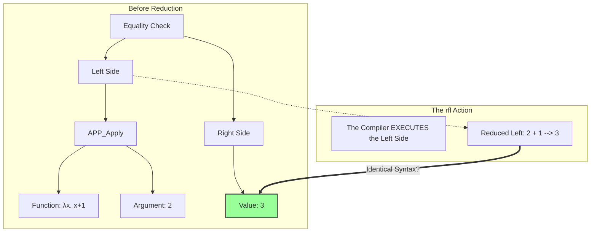
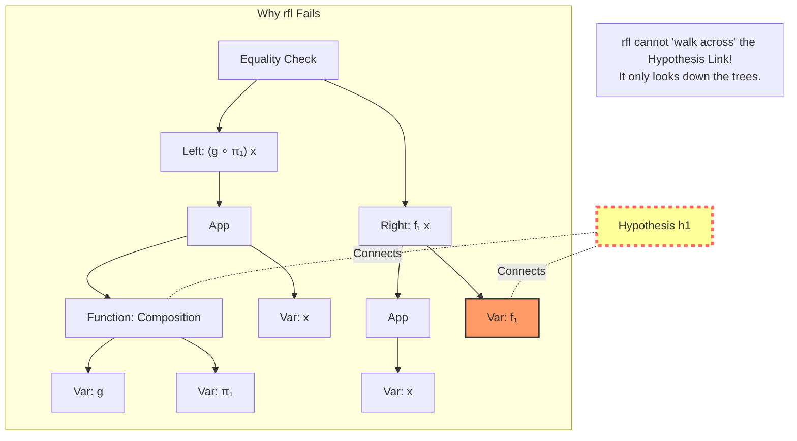
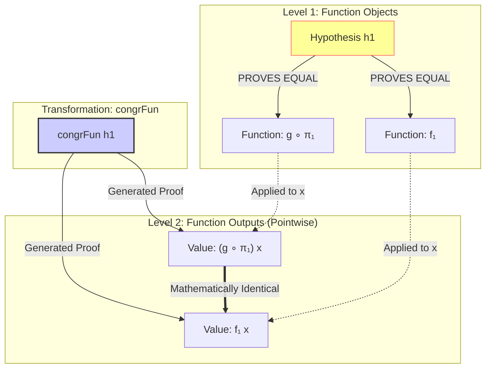

# The Anatomy of Equality: Definitions vs. Hypotheses

This article visualizes the "invisible wall" between **Computation** (what Lean executes) and **Logic** (what Lean proves), answering *why* `rfl` works for some things but fails for others.

---

## 1. The Two Worlds of Lean

To understand `rfl`, you must imagine Lean as having two distinct brains:
1.  **The Compiler (Definitional)**: It sees code. It runs code. It simplifies code.
2.  **The Logician (Propositional)**: It sees opaque symbols. It trusts facts (hypotheses).

### `rfl` is the Compiler's Tool
`rfl` stands for **Reflexivity**. It asks the Compiler:
> *"If you run the left side and the right side until they stop changing, do you get the exact same Syntax Tree?"*

If the answer is **Yes**, `rfl` works.
If the answer is **No** (even if they *seem* logically equal), `rfl` fails.

---

## 2. When `rfl` Works: AST Reduction

Let's look at a case where `rfl` works.

**Goal:** `(fun x => x + 1) 2 = 3`

To the Human eye, this is "math".
To the Lean Compiler, this is **Tree Surgery** (Beta Reduction).

**Why it works:** The compiler *knows* the definition of `+` and how to apply a function. It runs the code `2+1`, produces `3`, sees `3` on the other side, and says "These are the same Tree."

---

## 3. When `rfl` Fails: The Opaque Wall

Now let's look at your specific failure case.

**Goal:** `(g ∘ π₁) x = f₁ x`
**Hypothesis (Fact):** `h1 : g ∘ π₁ = f₁`

To the Logician (You), `f₁` IS `g ∘ π₁` because `h1` says so.
To the Compiler (`rfl`), `f₁` is just a variable name. It has no definition. It is a "black box".

**The Problem:** `rfl` only looks **down**. It sees `Composition` on the left and `Var: f₁` on the right.
*   Is `Composition` the same code as `f₁`? **No.**
*   Does `f₁` have a definition definition (starting with `:=`)? **No.** (It was passed as an argument `{f₁ : ...}`).
*   **Result:** `rfl` sees two completely different trees and gives up.

---

## 4. The Bridge: `congrFun`

Since `rfl` is blind to hypotheses, we need a tactic that explicitly uses the hypothesis `h1`.

`congrFun` (Congruence for Functions) acts as a bridge. It takes a "High Level" equality (Function Equality) and pushes it down to a "Low Level" equality (Value Equality).

### The Logic Flow
1.  **You have:** `h1 : LeftFunc = RightFunc` (Level 1 Equality).
2.  **`rfl` sees:** `LeftFunc x` vs `RightFunc x` (Level 2 definitions). It sees no match.
3.  **`congrFun h1` says:** "Because Level 1 is equal, logic dictates Level 2 MUST be equal."
4.  **`exact`**: Accepts this logical deduction as the proof.

## Summary Checklist

| If you have... | And you want... | Use this... |
| :--- | :--- | :--- |
| `def f := g` | `f x = g x` | `rfl` (Definitions unfold automatically) |
| `h : f = g` | `f x = g x` | `congrFun h x` (Use the hypothesis) |
| `h : x = y` | `f x = f y` | `congrArg f h` (Same function, equal args) |
| `h : x = y` | `x = y` | `exact h` (Exact match) |
