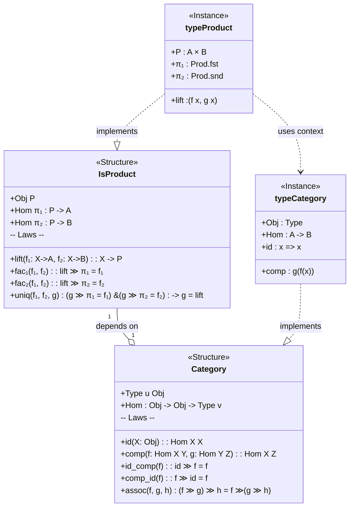

# Basic Category Theory - Code Structure

This diagram faithfully represents the structures and definitions in `basic_cat.lean`.

```mermaid
classDiagram
    %% 1. Definition of a Category
    class Category {
        <<Structure>>
        +Type u Obj
        +Hom : Obj -> Obj -> Type v
        +id(X: Obj) : Hom X X
        +comp(f: Hom X Y, g: Hom Y Z) : Hom X Z
        -- Laws --
        +id_comp(f) : id ≫ f = f
        +comp_id(f) : f ≫ id = f
        +assoc(f, g, h) : (f ≫ g) ≫ h = f ≫ (g ≫ h)
    }

    %% 3. The Universal Property of a Product
    class IsProduct {
        <<Structure>>
        +Obj P
        +Hom π₁ : P -> A
        +Hom π₂ : P -> B
        +lift(f₁: X->A, f₂: X->B) : X -> P
        -- Laws --
        +fac₁(f₁, f₂) : lift ≫ π₁ = f₁
        +fac₂(f₁, f₂) : lift ≫ π₂ = f₂
        +uniq(f₁, f₂, g) : (g ≫ π₁ = f₁) & (g ≫ π₂ = f₂) -> g = lift
    }

    %% 4. Concrete implementation for Type (Sets)
    class typeCategory {
        <<Instance>>
        +Obj : Type
        +Hom : A -> B
        +id : x => x
        +comp : g(f(x))
    }

    %% 5. Product of Types (A x B)
    class typeProduct {
        <<Instance>>
        +P : A × B
        +π₁ : Prod.fst
        +π₂ : Prod.snd
        +lift : (f x, g x)
    }

    %% Relationships
    IsProduct "1" --o "1" Category : depends on
    typeCategory ..|> Category : implements
    typeProduct ..|> IsProduct : implements
    typeProduct ..> typeCategory : uses context
```
