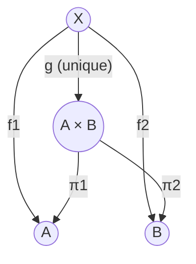

# Universal Property of Products

In category theory, a **product** of two objects $A$ and $B$ is an object $P$ (often denoted $A \times B$) equipped with two morphisms (projections):
- $\pi_1 : P \to A$
- $\pi_2 : P \to B$

satisfying the following **universal property**.

## The Universal Property

For **any** object $X$ and **any** pair of morphisms $f_1 : X \to A$ and $f_2 : X \to B$, there exists a **unique** morphism $g : X \to P$ such that the following diagram commutes:

- $\pi_1 \circ g = f_1$
- $\pi_2 \circ g = f_2$

This unique morphism $g$ is often denoted as $\langle f_1, f_2 \rangle$.

## First-Order Logic Formulation

In the language of category theory (where we quantify over objects and morphisms), the universal property of the product $P = A \times B$ with projections $\pi_1, \pi_2$ can be stated formally as:

$$
\forall X, \forall f_1 \in \text{Hom}(X, A), \forall f_2 \in \text{Hom}(X, B), \exists! g \in \text{Hom}(X, P) \text{ such that } (\pi_1 \circ g = f_1 \land \pi_2 \circ g = f_2)
$$

This captures the essence of "existence and uniqueness" ($\exists!$) which is the hallmark of a universal property.


## Diagram



## Intuition & Examples

The product $A \times B$ is the "best" object that maps to both $A$ and $B$. "Best" means that any other object $X$ that maps to $A$ and $B$ does so *via* the product.

### 1. Set Theory (Category **Set**)
In the category of sets:
- Objects are sets.
- Morphisms are functions.
- The product $A \times B$ is the **Cartesian product** $\{(a, b) \mid a \in A, b \in B\}$.
- The projections return the first and second elements of the pair.
- Given $f_1: X \to A$ and $f_2: X \to B$, the unique function $g: X \to A \times B$ is defined by $g(x) = (f_1(x), f_2(x))$.

### 2. Programming (Types)
In functional programming (like Haskell or ML):
- Objects are Types.
- Morphisms are Functions.
- The product is a **Tuple** (or a Struct/Record).
- `(Int, Bool)` is the product of `Int` and `Bool`.
- Projections are `fst` and `snd`.
- The universal property says: if you have a function returning an `Int` and a function returning a `Bool`, you can combine them into a single function returning `(Int, Bool)`.

```haskell
-- Given
f1 :: X -> A
f2 :: X -> B

-- We can construct unique g
g :: X -> (A, B)
g x = (f1 x, f2 x)
```
