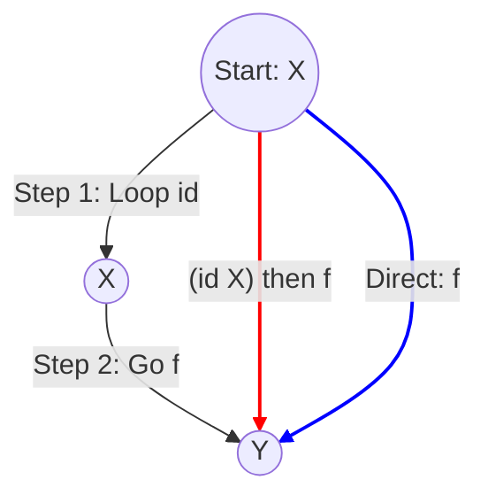
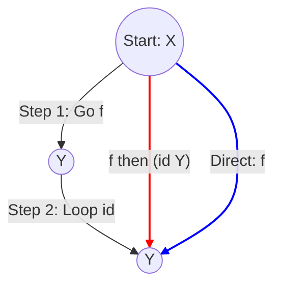
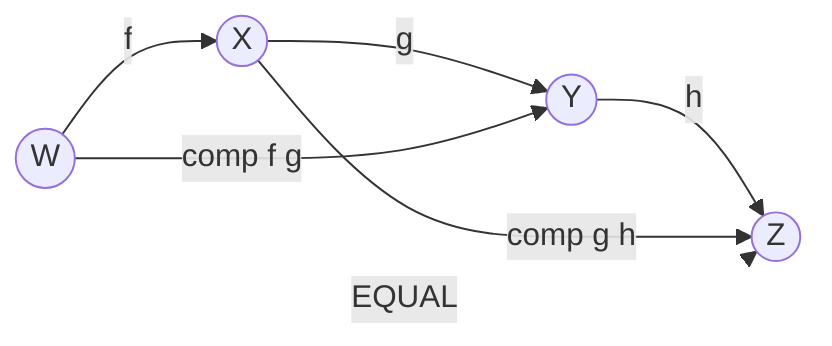
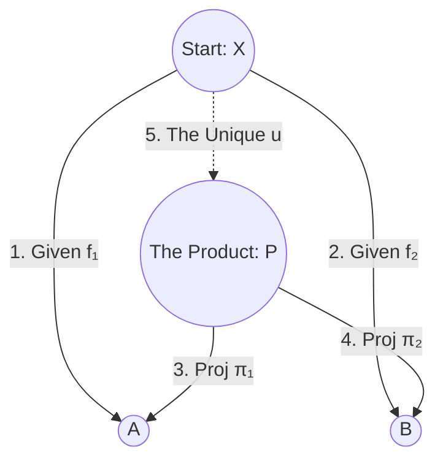

# Category Theory Visualizations

## 1. Category Axioms

### Left Identity
`comp (id X) f = f`

### Right Identity
`comp f (id Y) = f`

**How to Follow:**
1.  **Left Identity:** doing nothing *before* you leave X is the same as just leaving.
2.  **Right Identity:** doing nothing *after* you arrive at Y is the same as just arriving.

---

### Associativity
`comp (comp f g) h = comp f (comp g h)`

The standard visualization is two "glued" triangles sharing a sequence.

**How to Follow:**
1.  **Triangle 1 (Left):** Going $W \to X \to Y$ is the same as the shortcut $W \to Y$ (`comp f g`).
2.  **Triangle 2 (Right):** Going $X \to Y \to Z$ is the same as the shortcut $X \to Z$ (`comp g h`).
3.  **The Law:** The path $W \to Y \to Z$ (`(f ≫ g) ≫ h`) is equal to the path $W \to X \to Z$ (`f ≫ (g ≫ h)`).

---

## 2. Binary Product

### The Universal Property
**Structure:** `BinaryProduct C A B`

This structure bundles **Data** (Objects and Arrows) and **Laws** (Proofs). The diagram below visualizes all of them.

### Mapping Code to Diagram

#### The Data (Fields)
| Field | Name | In Diagram | Role |
| :--- | :--- | :--- | :--- |
| `P` | Product Object | The central node **P** | The "hub" connecting A and B. |
| `π₁` | Projection 1 | Arrow **P $\to$ A** | Extracts the 1st component. |
| `π₂` | Projection 2 | Arrow **P $\to$ B** | Extracts the 2nd component. |
| `lift` | The Lifter | Arrow **u** (Dashed) | Constructs a map to P from any pair ($f_1, f_2$). |

#### The Laws (Proofs)

**1. Factorization (`fac₁`)**
*   **Code:** `comp (lift f₁ f₂) π₁ = f₁`
*   **Visual:** Following the dashed line ($u$) then $\pi_1$ is the **SAME PATH** as following $f_1$.
*   *Commutative Triangle (Left):* $X \to P \to A \equiv X \to A$

**2. Factorization (`fac₂`)**
*   **Code:** `comp (lift f₁ f₂) π₂ = f₂`
*   **Visual:** Following the dashed line ($u$) then $\pi_2$ is the **SAME PATH** as following $f_2$.
*   *Commutative Triangle (Right):* $X \to P \to B \equiv X \to B$

**3. Uniqueness (`uniq`)**
*   **Code:** `∀ g, ... → g = lift f₁ f₂`
*   **Visual:** There is **ONLY ONE** dashed arrow that makes the triangles work.
*   *Meaning:* If you find another arrow $g$ that fits in that slot, it must be equal to our $u$.
